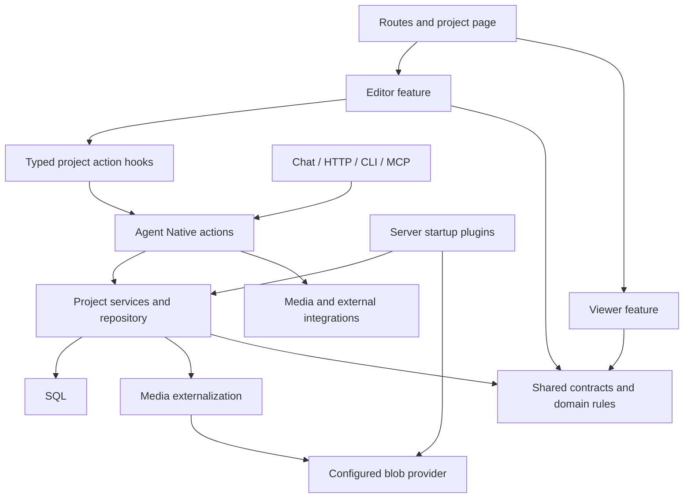

# C-CAN architecture

C-CAN is a modular application deployed as one React Router/Nitro product.
Agent Native owns authentication, action transport, chat, sharing, notifications
and database synchronization. The ICCPlus document remains authoritative; this
refactor introduces no document-format or database-schema migration.

## Module ownership

| Location                 | Responsibility                                                                                                |
| ------------------------ | ------------------------------------------------------------------------------------------------------------- |
| `app/routes/`            | Route matching, redirects, metadata and page composition                                                      |
| `app/features/explorer/` | Public discovery, release details, publishing dialog, ratings and standalone player                           |
| `app/features/projects/` | Project library, import UI, project page and typed action hooks                                               |
| `app/features/editor/`   | Authoring panels, planning, visual editing, history and review                                                |
| `app/features/viewer/`   | Play-state hook, renderer, requirements/scores, navigation, screenshots, build dialogs, preferences and audio |
| `app/components/`        | Shared UI primitives, application layout and reusable inline editing                                          |
| `app/lib/`, `app/hooks/` | Browser utilities and reusable framework integration hooks                                                    |
| `actions/`               | Named, validated application operations shared by UI/chat/HTTP/CLI/MCP                                        |
| `shared/`                | Pure document types, contracts, normalization, selectors and gameplay rules                                   |
| `server/publishing/`     | Public snapshot lifecycle, discovery and rating aggregates                                                    |
| `server/projects/`       | Authorized reads, persistence, metadata queries, response projection, audit and events                        |
| `server/media/`          | Image externalization and preview generation                                                                  |
| `server/storage/`        | Local blob-provider implementation and reads                                                                  |
| `server/integrations/`   | External image-source clients and credential resolution                                                       |
| `server/viewer/`         | Authenticated screenshot capture/receipt lifecycle                                                            |
| `server/agent/`          | Model engine, mention adapter and final-response policy                                                       |
| `server/plugins/`        | Composition roots: register adapters and initialize infrastructure                                            |
| `server/routes/`         | Upload/binary protocol adapters and the framework SSR entry                                                   |
| `server/db/`             | Portable SQL schema, connection factory and development seed                                                  |

There is no second CRUD API. Actions retain their existing names, input schemas,
authorization semantics and result keys. Server services never import actions;
for example, project mentions and `search-projects` call the same metadata query.
Services also never import startup plugins. The upload plugin installs the local
provider, while preview generation and screenshot retrieval import storage code
without installing a server runtime as a side effect.

## Contracts and dependencies

`shared/project-contracts.ts` defines project summaries and detail results.
`server/projects/presentation.ts` constructs those responses. Browser hooks use
Core's generated action registry to infer inputs and results instead of overriding
them with loose generic types. Regenerate this registry with `pnpm typecheck`;
do not edit `.generated/` manually or import an action's runtime into the browser.

The previous frontend detail type described a different summary shape from the
server, and mutation types allowed several imaginary ID envelopes. Creation now
has one explicit `id` contract. Existing wire responses are preserved.

`tests/architecture.spec.ts` scans literal local imports/re-exports and enforces:

- shared domain code does not import UI, actions, server code or Core infrastructure;
- browser code does not import server actions, SQL or Node APIs (the SSR entry is explicit);
- actions call project services instead of importing SQL tables/connections;
- server services do not depend on UI, action entry points or startup plugins;
- the viewer does not depend on editor or project-management features;
- local module dependencies are acyclic;
- implementation helpers stay outside action discovery.

This is a structural check of literal imports, not a general security analyzer.
The framework's Doctor guards remain the separate access/configuration checks.

## Document writes and concurrency

Every document mutation loads through `getProjectOrThrow(projectId, ctx, role)`
and passes the original stored JSON to `saveProject`. The repository requires
that baseline at both the type and runtime boundaries. It externalizes embedded
media, then updates SQL only if the stored document still equals the baseline.
For granular edits, a competing write is merged against the original baseline
and retried up to four CAS attempts. Different fields and stable-ID items survive;
overlapping edits, delete/edit races and ambiguous arrays produce HTTP 409.
Checkpoint, planning and validated build operations retain strict revision checks.

Image operations that download remote assets re-read the document afterward,
merge their results into that current document, then conditionally save that read
version. Settings description and document changes now save in the same SQL
update. A failed upload or a lost save race cannot leave half of a settings edit
persisted. Restore already follows the same atomic metadata/document boundary.

Editors also send field baselines through `useProjectEdit`, reconcile shared
updates through `useSavedField`, and require explicit resolution for conflicting
drafts. Core's resource-scoped events reach invited editors as well as owners.
Awareness and collaborator navigation use the Core/Toolkit collaboration kit;
the App document has one authoritative action/SQL save path. Field drafts stream
through shared Y.Text/maps and autosave through baseline-checked field batches.
Authoring previews apply these drafts immediately; public releases stay isolated.
See `docs/cyoa-collaboration.md` for transport and persistence boundaries.
Planning retains its separate draft revision and live-text baseline.
Comparing whole JSON avoids an incompatible migration now, but an explicit
revision column and scoped document queries remain useful future work at scale.

Access checks remain at authorized reads; internal resource-history reads use an
explicit `none` role only after Core has performed its resource ACL check. Events
publish after successful persistence and retain their existing actor scoping.
Blob writes and SQL updates are not one distributed transaction; a failed SQL
commit can leave an unreferenced blob for provider retention/cleanup to handle.

## Frontend lifecycle and loading

The viewer entry composes focused row, choice, addon, score, requirement, search,
point-bar and dialog modules. `use-cyoa.ts` remains the player-state controller and
uses the shared gameplay engine. Audio has its own hook and teardown lifecycle;
the canvas owns layout, visual-editor callbacks and viewer effects.

`ProjectPage` loads viewer/visual-editor modes lazily. `EditorPanels` loads each
panel when its tab mounts; a shared Suspense fallback keeps loading visible.
The shell, URL selection, agent navigation and save workflows remain shared.
Loading code on demand reduces the initial editor bundle; the project query
still loads the full document. No claim of scoped document downloading is made.

## Verification and delivery

Run `pnpm check` for types, regression tests and Doctor. It includes the dependency
checks and disposable in-memory PGlite concurrency tests. `pnpm build` checks
client, SSR and Nitro production bundles. `pnpm script roundtrip-check` verifies
the large ICCPlus fixture; `pnpm script e2e-import-check` also exercises persisted
media import/export and removes its disposable project.

The CI workflow installs the frozen lockfile, runs these source checks and the
roundtrip test, then builds with a temporary CI-only signing secret. It does not
deploy, connect external providers or execute paid model evaluations. Its setup
uses the official [Node action](https://github.com/actions/setup-node) and
[pnpm action](https://github.com/pnpm/action-setup) guidance.

See [Production operations](production.md) for persistence, authentication,
ownership recovery and rollout requirements. Historical review documents record
their original verification dates; this document describes the current layout.

## Refactor verification (2026-09-11)

- TypeScript passes with action implementations and test files included.
- 828 tests pass across 43 files, including dependency direction/cycle checks,
  competing SQL writes, atomic settings saves and audio teardown.
- Doctor passes all nine guards with no findings or warnings.
- The ICCPlus fixture roundtrip loses no fields or values. The persisted import
  check passes with 108 externalized image resources and no dangling references.
- An authenticated Chromium check opens all 22 editor panels, resolves visual
  editor row/choice links, selects viewer choices, creates screenshot feedback
  and checks a 390px mobile viewport for horizontal overflow.
- The client, SSR and Node/Nitro production build completes and emits separate
  viewer/editor-panel chunks. Large shared chunks remain above the bundler's
  warning threshold. The local build also reports missing production auth
  configuration; deployment requires the stable credentials described in the
  operations guide. No hosted runtime or remote CI run was verified here.

The subsequent publishing feature adds named migrations for release snapshots and
reader ballots without changing ICCPlus authoring JSON. See [Publishing](publishing.md).
